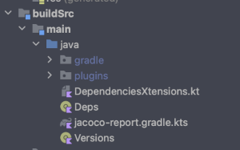

# Hello Compose Movies

### App de exemplo com Jetpack Compose, Clean Architecture e padrão MVI
___  
#### Arquitetura
___  
Foi utilizada a arquitetura Clean com abstrações de camadas arquiteturais e por features
- **Data**:          
  /local/Dao        
  /local/Entities        
  /remote/model
- **Domain**
- **Navigation**
- **Services**
-  **Presentation**
- **Ui**
- **Features**:       
  features/login    
  features/home    
  features/details
 ___
#### Padrão MVI
___  

O padrão MVI é um ótimo padrão para se trabalhar com o Compose:
- Fluxo de dados unidirecional e cíclico
- Gerenciamento de estado usando imutabilidade para ter uma única fonte de verdade.
- Facilidade de depuração
- Facilidade de teste .

Utilizamos uma  **data class** para representar os  estados da View  

Ex: **LoginUiStates**

Utilizamos uma **sealed class** para representar os eventos           
           
Ex: **LoginEvents**

Como funciona:            
Basicamente a **ViewModel** recebe um Evento da View,          
este **Evento** dispara uma acão, e o efeito desta ação causa uma alteracão na classe de estados da View **UiStates**, que  faz com que o **recomposition** do Compose renderize as alterações na View para corresponder ao novo estado  da View
___ 
#### UI
___  
Para criação das Views foi utilizado o **Jetpack Compose**, uma api para criação declarativa de UIs nativas,  recomendado pelo Android.
___ 
#### Gerenciamento de dependências
___ 
O gerenciamento de dependências do projeto foi feito com **Gradle Plugin e Kotlin DSL**

Algumas vantagens de se usar kotlin DSL e não Groovy:
- Preenchimento automático do código(_autocomplete_)
- Sintaxe Kotlin destacada (_highlighting_)
- Navegação (tracking) de código para as fontes
- Documentação
- Refatorações etc …
- Scalabilidade: existem muitas configurações que podem ser compartilhadas entre módulos, bibliotecas, testes etc, e o que envolve um tempo considerável gerenciando várias dependências e versões nos vários módulos do projeto.          
  

Utilizamos a seguinte estrutura:             
**Deps** : onde guardamos as referências das dependências/libs do projeto          

**Versions**: onde guardamos as versões dessas dependências/libs

**DependenciesXtensions** onde agrupamos as dependências por afinidades

para declarar uma dependência utilizamos a extensão,          
invocando no ***build.gradle.kts*** do módulo que desejarmos colocar a dependência :

Ex:

     coilDependencies()  

___ 
#### Injeção de dependências
___  
Foi utilizada a lib koin para injeção de dependências do projeto
___ 
#### Navegação
___  
A navegação do app utiliza a API do Compose Navigations e para tal temos uma **sealed class** que guarda as nossas rotas de navegação:             
Routes.kt          

___ 
#### Features do App
___  
- LoginScreen.kt  
- HomeScreen.kt  
- DetailScreen.kt  
___  
#### Prints do app
___             

___
#### Instruções específicas do projeto
___  
Para realizar o Login utilize a          
Senha fake : abc123

Foi utilizada a lib **AnimatedNavHost** para navegação entre telas, com efeitos de transições entre as telas, porém esta lib ainda não conta com suporte a testes, e por tal motivo foi criado um arquivo com a lib padrão do compose apenas para rodar os testes de navegação, para isso execute os procedimentos citados abaixo:          
Para rodar teste navigation:

***Alternativa 01:***  
Substitua o componente [AnimatedNavHost] no arquivo [NavvHost] pelo [NavHost] padrao do compose, exemplo no arquivo [NavHostForTest] Depois altere na [MainActivity] de [val navController = rememberAnimatedNavController()] para [val navController = rememberNavController()] Feito isso rode o teste

***Alternativa 02:***

Também pode se utilizar a branch "***teste***" caso não queira realizar nenhuma das alterações acima mencionadas, e rodar os testes nela
___ 
#### Testes unitários (tests)
___
##### Presentation
- /presentation/detail/DetailViewModelTest.kt
- /presentation/home/HomeViewModelTest.kt
- /presentation/login/LoginViewModelTest.kt
##### Utils

- /DateConversionTest
##### Api

- /remote/service/PopularMoviesServiceTest

Para rodar os testes Unitários:

Clique com o botão direito do mouse em cima da pasta **com(test)** em seguida em rodar os testes conforme imagem, lembre-se de utilizar as instruções acima ()

ou digite no terminal:

     ./gradlew testDebugUnitTest   

___ 
#### Testes instrumentais (androidTests)
___  
##### Room Data Base

- /local/RoomDbTest.kt
##### Navigation

- /navigation/NavigationTest
##### Ui

- /ui/DetailUiTest
- /ui/HomeUiTest
- /ui/LoginUiTest

Para rodar os testes Intrumentais:

Clique com o botão direito do mouse em cima da pasta **com(androidTest)** em seguida em rodar os testes conforme imagem, lembre-se de utilizar as instruções acima (alternativa 1 ou 2)

ou digite no terminal:

     ./gradlew connectedDebugAndroidTest  

___
#### Cobertura de testes - Jacoco
___  

Para rodar o jacoco utilize os scripts da pasta/scripts/jacoco no gradle:          

ou pelo terminal, rode o comando:

    ./gradlew jacocoReport   

Para abrir no Browser:

Coverage Report:  
PATH --> /app/build/reports/coverage/androidTest/debug/connected/index.html

___ 
#### Sumário de libs utilizadas no projeto
 ___
#### Compose
androidx.activity:activity-compose:${activityComposeVersion}          
androidx.navigation:navigation-compose:${composeNavVersion}

#### Coil
io.coil-kt:coil-compose:${coilComposeVersion}

#### Koin
io.insert-koin:koin-androidx-compose:${koinComposeVersion}

#### Interceptor
com.squareup.okhttp3:logging-interceptor:${interceptorVersion}

#### Jacoco
org.jacoco:org.jacoco.core:${jacocoVersion}

#### Material Design 3
androidx.compose.material3:material3

#### Retrofit
com.squareup.retrofit2:retrofit:${retrofitVersion}        
com.squareup.retrofit2:converter-gson:${retrofitVersion}

#### Room
androidx.room:room-runtime:${roomVersion}        
androidx.room:room-compiler:${roomVersion}

#### Splash Screen
androidx.core:core-splashscreen:${splashScreenVersion}

#### Turbine
turbineFlowTests =  app.cash.turbine:turbine:${turbineVersion}

  

