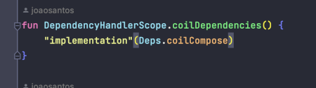
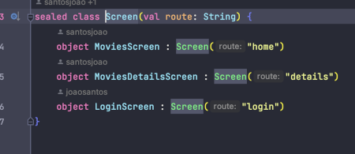
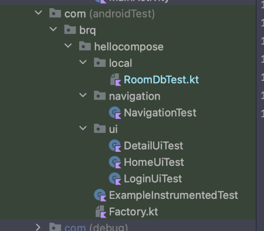

# Hello Compose Movies

### App de exemplo utilizando Jetpack Compose, Clean Architecture e padrão MVI

### Prints do app
        

### Arquitetura
Foi utilizada a arquitetura Clean
#### - Camadas
Data: [
/local/Dao
/local/Entities

/remote/model
]
Domain
Navigation
Services
Presentation
Ui

[FOTO CAMADAS]

### Pdrão MVI
O padrão MVI é um ótimo padrão para trabalhar com o Compose , nele temos um fluxo unidirecional para atualizar os estados das Views e  seus efeitos colaterais para lidar com eventos usando LaunchedEffect, SideEffect etcc....

Utilizamos uma  **data class** para representar os possíveis estados da UI </b>

Ex: LoginUiStates

Utilizamos uma **sealed class** para representar os eventos da tela  </b>
Ex: LoginEvents

Como funciona: </b>
Basicamente a **ViewModel** recebe um Evento da View,
este **Evento** dispara uma acão, e o efeito desta ação causa uma alteracão na classe de estados da View (**UiStates**), que  faz com que o recomposition do Compose renderize as alterações na View para corresponder ao novo estado

### Jetpack Compose
O Jetpack Compose é um kit de ferramentas para criação declarativa de UIs nativas, recomendado pelo Android. Ele simplifica e acelera o desenvolvimento da IU no Android.

### Gradle Kotlin DSL

O gerenciamento de dependências do projeto foi feito com Gradle Plugin e Kotlin DSL

Algumas vantagens de se usar kotlin DSL e não Groovy:
-   Preenchimento automático do código(_autocomplete_)
-   Sintaxe Kotlin destacada (_highlighting_)
-   Navegação (tracking) de código para as fontes
-   Documentação
-   Refatorações etc …
-  Scalabilidade: existem muitas configurações que podem ser compartilhadas entre módulos, bibliotecas, testes etc, e o que envolve um tempo considerável gerenciando várias dependências e versões nos vários módulos do projeto.
   

Utilizamos a seguinte estrutura:  </b>
**Deps** : onde guardamos as referencias das dependencias/libs do projeto

**Versions**: onde guardamos as versões dessas dependencias/libs

**DependenciesXtensions** onde agrupamos as dependencias por afinidades

para declara dependência utilizamos a exensão
invocando

		coilDependencies()  

no build.gradle do módulo que desejarmos

### Navigation
A navegação do app utiliza a API do Compose Navigations e para tal temos uma **sealed class** que guardas nossas rotas de navegação:  </b>
Routes.kt

### Instruções específicas do projeto
Para realizar o Login utilize a
Senha fake : abc123

Foi utilizada a lib **AnimatedNavHost** para navegação entre telas, com efeitos de transições entre as telas, porém esta lib ainda não conta com suporte a testes, e por tal motivo foi criado um arquivo com a lib padrão do compose apenas para rodar os testes de navegação, para isso execute os procedimentos citados abaixo:
Para rodar teste navigation:

       Substitua o componente [AnimatedNavHost] no arquivo [NavvHost]
       pelo [NavHost] padrao do compose, exemplo no arquivo [NavHostForTest]
       Depois altere na [MainActivity]  de [val navController = rememberAnimatedNavController()]
       para [val navController = rememberNavController()]
       Feito isso rode o teste

### Telas do App

LoginScreen.kt </b>
HomeScreen.kt </b>
DetailScreen.kt </b>

### Testes unitários (tests)
- presentation:  /presentation/detail/DetailViewModelTest.kt
- presentation:  /presentation/home/HomeViewModelTest.kt
- presentation:  /presentation/login/LoginViewModelTest.kt
- presentation: /DateConversionTest
- api: data/remote/service/PopularMoviesServiceTest

### Testes instrumentais (androidTests)
- database: /local/RoomDbTest.kt
- navigation:  /navigation/NavigationTest
- ui: /ui/DetailUiTest
- ui: /ui/HomeUiTest
- ui: /ui/LoginUiTest

### Cobertura de testes - Jacoco

Para rodar utilize os scripts:

### Libs utilizadas no projeto

#### JetpackCompose
androidx.activity:activity-compose:${activityComposeVersion}
androidx.navigation:navigation-compose:${composeNavVersion}"

#### Coil
"io.coil-kt:coil-compose:${coilComposeVersion}"

#### Koin
"io.insert-koin:koin-androidx-compose:${koinComposeVersion}"

#### Interceptor
"com.squareup.okhttp3:logging-interceptor:${interceptorVersion}"

#### Jacoco
"org.jacoco:org.jacoco.core:${jacocoVersion}"

#### Material Design 3
"androidx.compose.material3:material3"

#### Retrofit
"com.squareup.retrofit2:retrofit:${retrofitVersion}"
"com.squareup.retrofit2:converter-gson:${retrofitVersion}"

#### Room
"androidx.room:room-runtime:${roomVersion}"  
"androidx.room:room-compiler:${roomVersion}"

#### Splash Screen
"androidx.core:core-splashscreen:${splashScreenVersion}"

#### Turbine
turbineFlowTests =  "app.cash.turbine:turbine:${turbineVersion}"